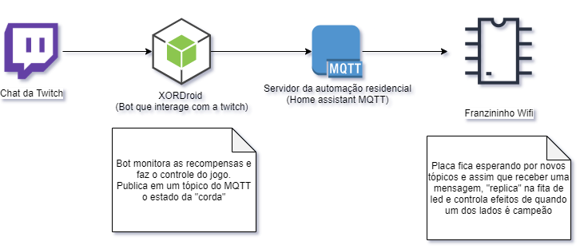

# Franzininho Wifi (ESP32-S2) Twitch Game

Cabo de Guerra estilo Round-6 no chat Twitch

Essa integração vai fazer parte do meu cenário para as lives que faço na [twitch.tv](https://www.twitch.tv/kaduzius/) e a idéia é que os visitantes do chat possam interagir comprando o ingresso (pilula vermelha e pilula azul) para participar do cabo de guerra.

Esse projeto faz parte da [Jornada do Desenvolvimento](https://www.embarcados.com.br/jornada-do-desenvolvimento-mouser-electronics/), concurso que presenteou vários projetos com a Franzininho Wifi (E o meu foi um deles \o/) e eu resolvi escrever o código em Python (CircuitPython) para aprender um pouco de Python embarcado.

Usarei uma fita de led rgb endereçavel ws2812b que será nosso mostrador, o pessoal vai comprando o ingresso pra um dos dois times (azul/vermelho) e assim que as posições forem completadas o jogo começa, quanto mais um dos lados tiverem "inscritos", mais forte vai ficando esse lado, até que um dos lados vença.

## Equipamentos

- Franzininho Wifi (ESP32-S2)
- Fita de led RGB (ws2812b)
- Transistor
- Fonte para fita de led / franzininho

## Arquitetura

## CircuitPython

Para usar o MQTT precisei fazer a instalação de uma lib da adafruit com suporte ao MQTT, foi bem simples depois de entender como funciona essa integração. Basicamente existe na página do [CircuitPython](https://circuitpython.org/) um bundle com várias bibliotecas já prontas para ser passado para o Franzininho, bastando pegar a versão do Bundle certa para a versão do Circuit instalado no seu Franzininho, jogar na pasta lib e "correr pro abraço".

### Anotações

Sempre que tentei fazer o uso da fita de led (20 leds) direto da Franzininho ele entra em modo de proteção, preciso alimentar o led de forma indepentente para evitar esse problema (e/ou entender o que está fazendo ele entrar em modo de proteção)

### POC

